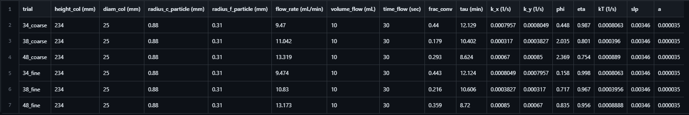
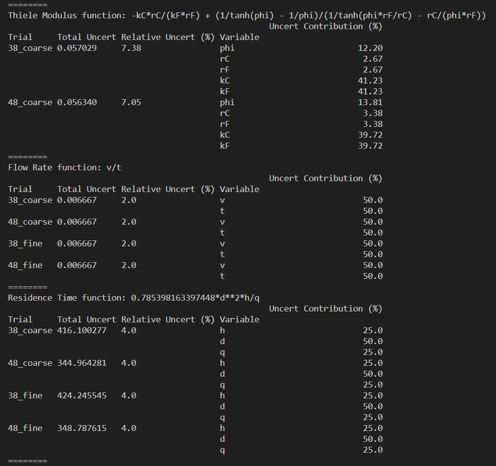
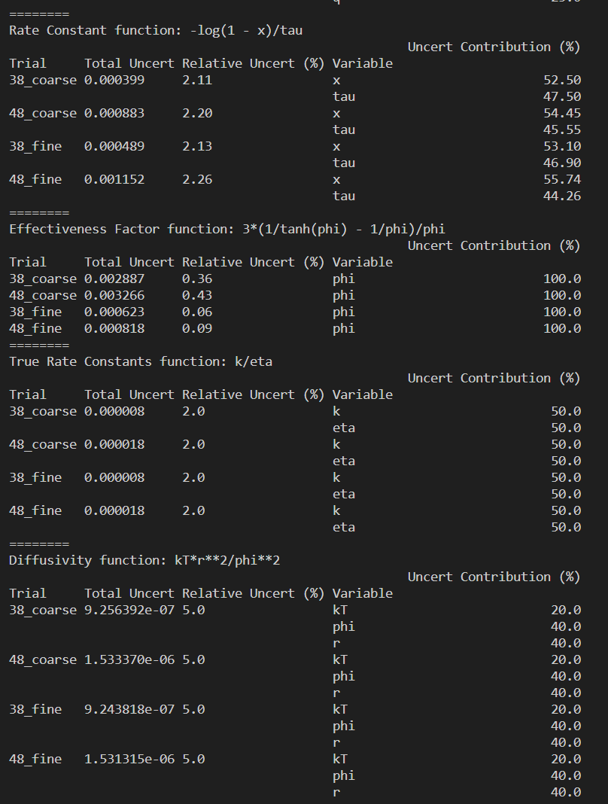
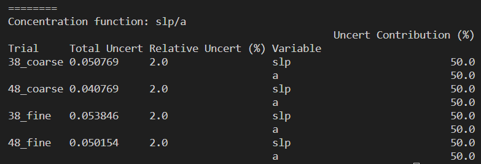

## [Input Data](https://github.com/hunterviolette/23fall/blob/main/363/catalytic_reactor/dat.csv)

## [Solution](https://github.com/hunterviolette/23fall/blob/main/363/catalytic_reactor/main.py)

