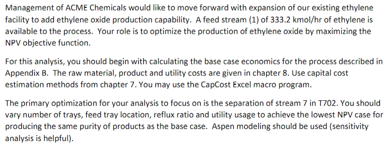
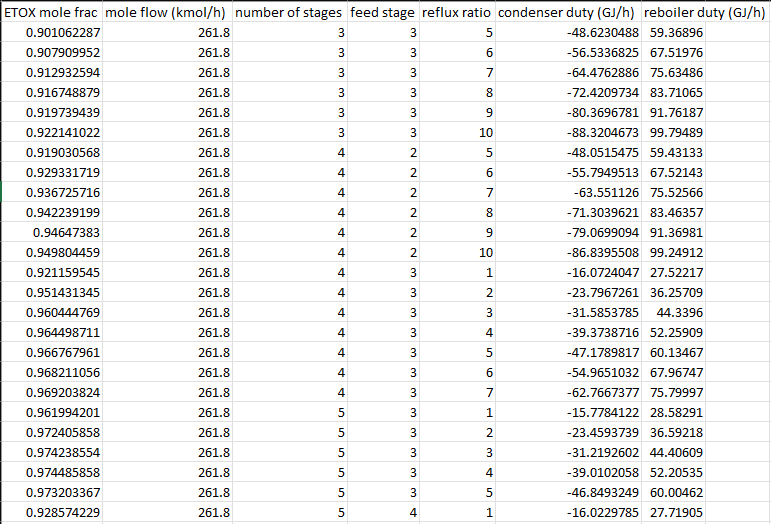
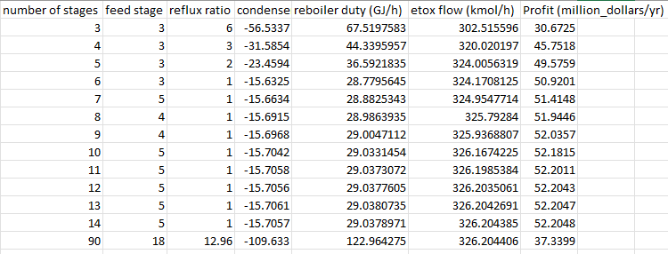
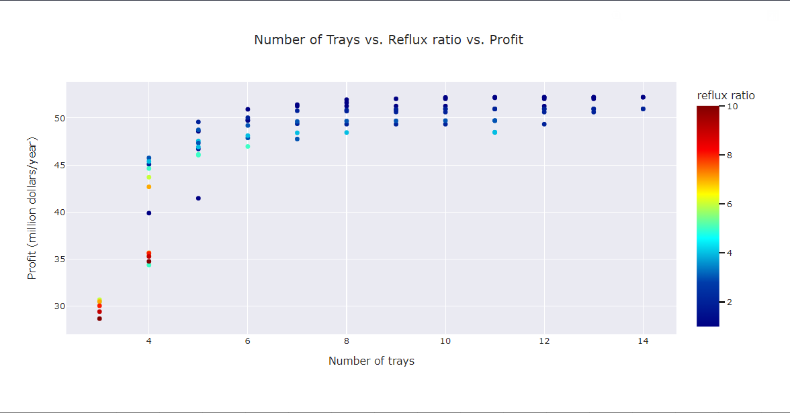
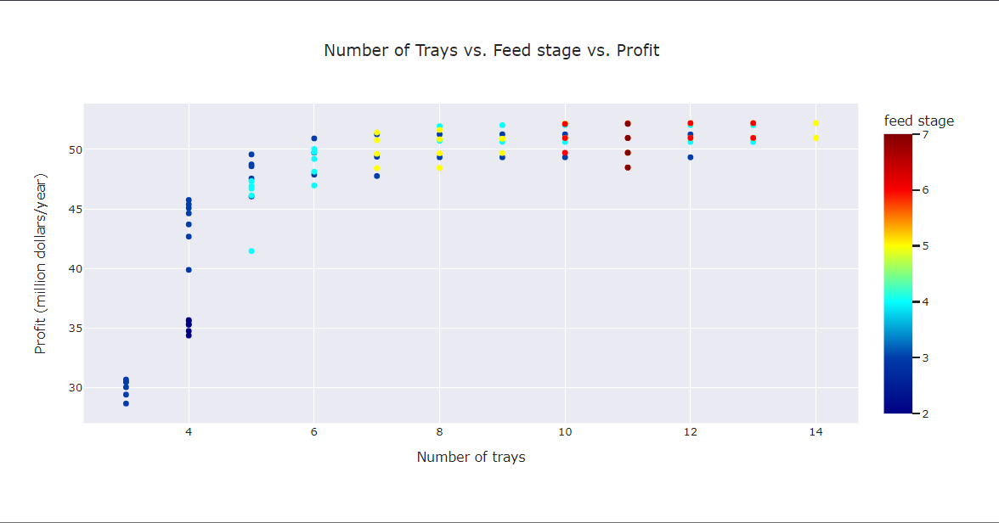
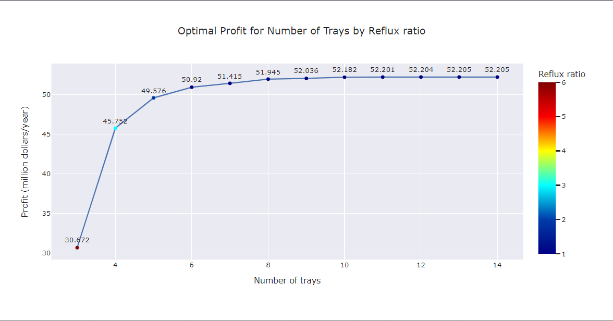
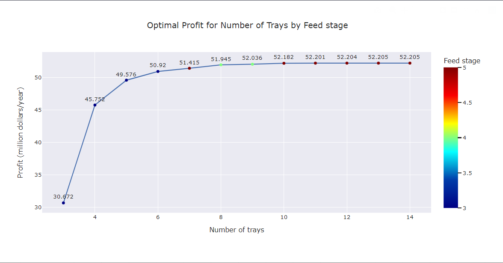

# Optimization of Unit 700: Production of Ethylene Oxide
## [Problem Statement](https://github.com/hunterviolette/23fall/blob/main/477/etox_proj/problem_statement.pdf)

## Optimize Design of Distillation Column, T-702:
### Input data generated from chemical process simulator Aspen Plus 

## Optimal Design per number of trays based on input data

## [Solution](https://github.com/hunterviolette/23fall/blob/main/477/etox_proj/main.py)

## [Report](https://github.com/hunterviolette/23fall/blob/main/477/etox_proj/report.pdf)
