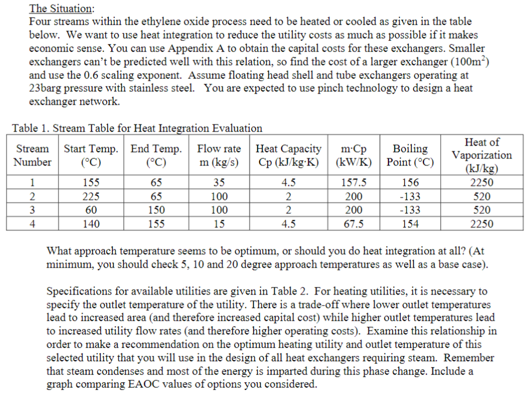
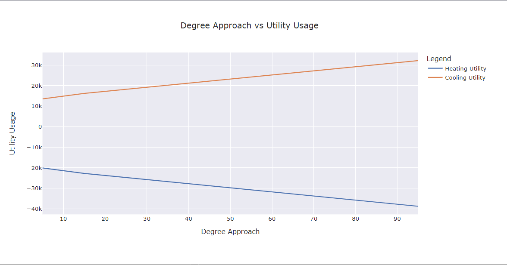
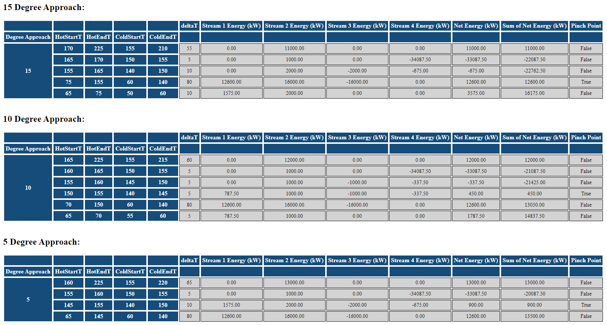
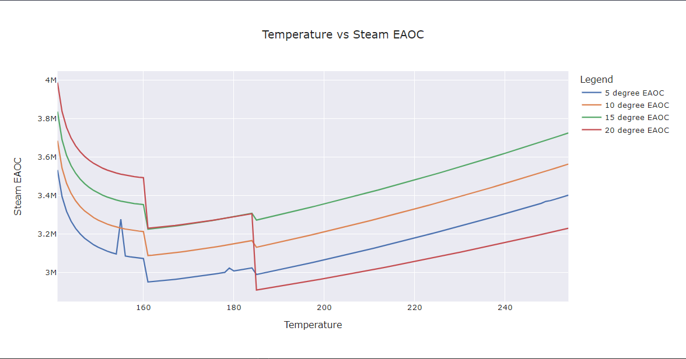
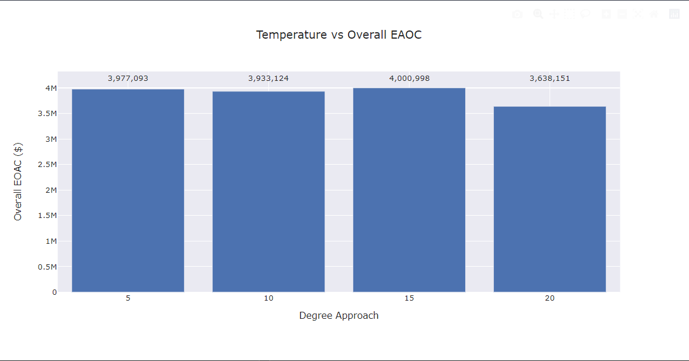

# Heat integration using pinch technology
## [Problem Statement](https://github.com/hunterviolette/23fall/blob/main/477/pinch_proj/problem_statement.pdf)

## [Solution](https://github.com/hunterviolette/23fall/blob/main/477/pinch_proj/pinch.py)
### Degree approach vs utility usage

### [Pinch Point Tables (open with any browser)](https://github.com/hunterviolette/23fall/blob/main/477/pinch_proj/mdf.html)

### Capital cost analysis

