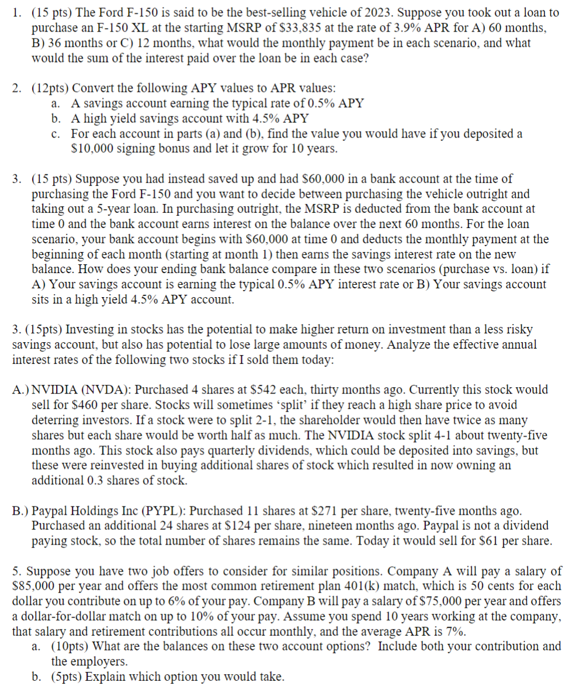
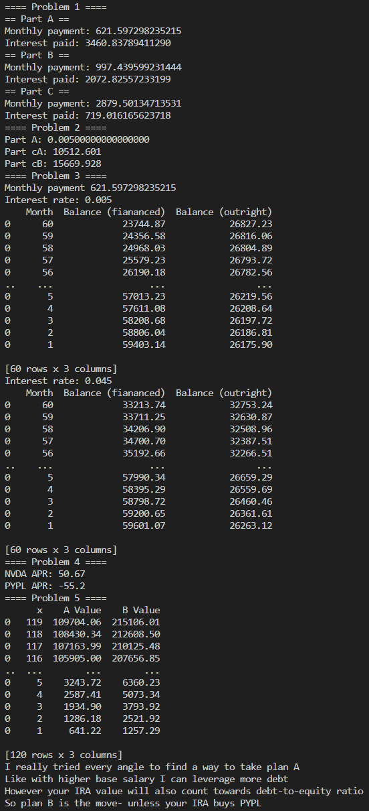
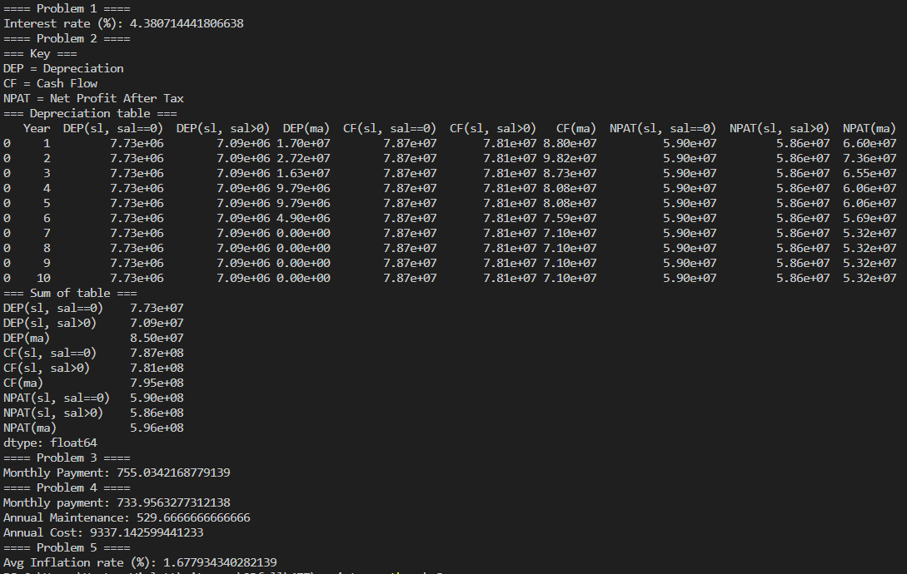
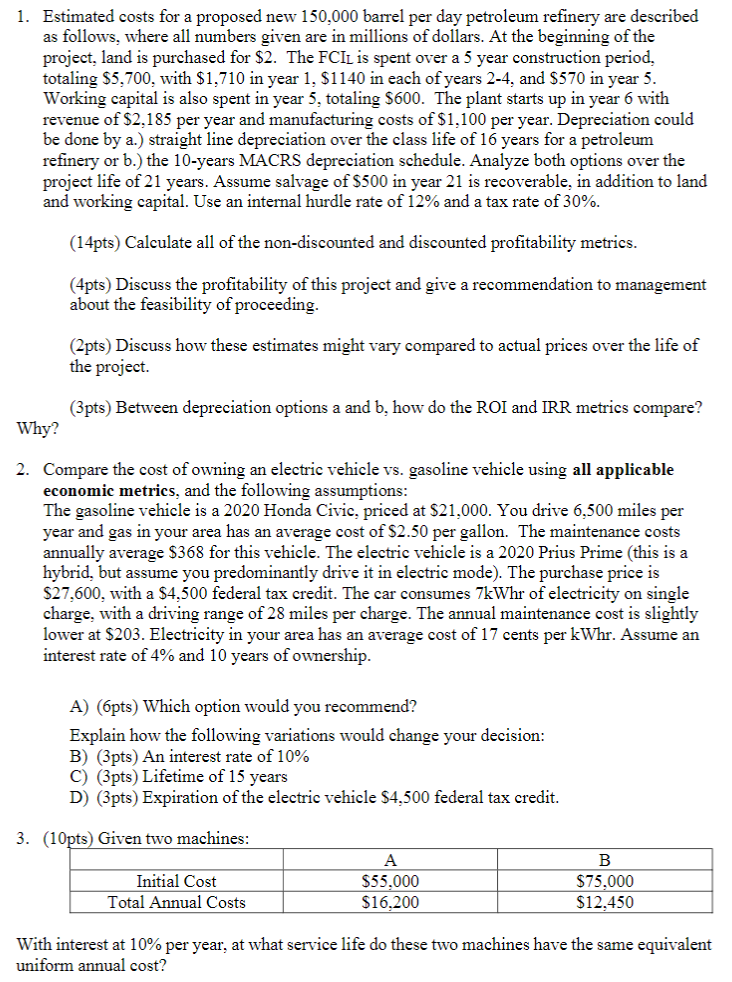
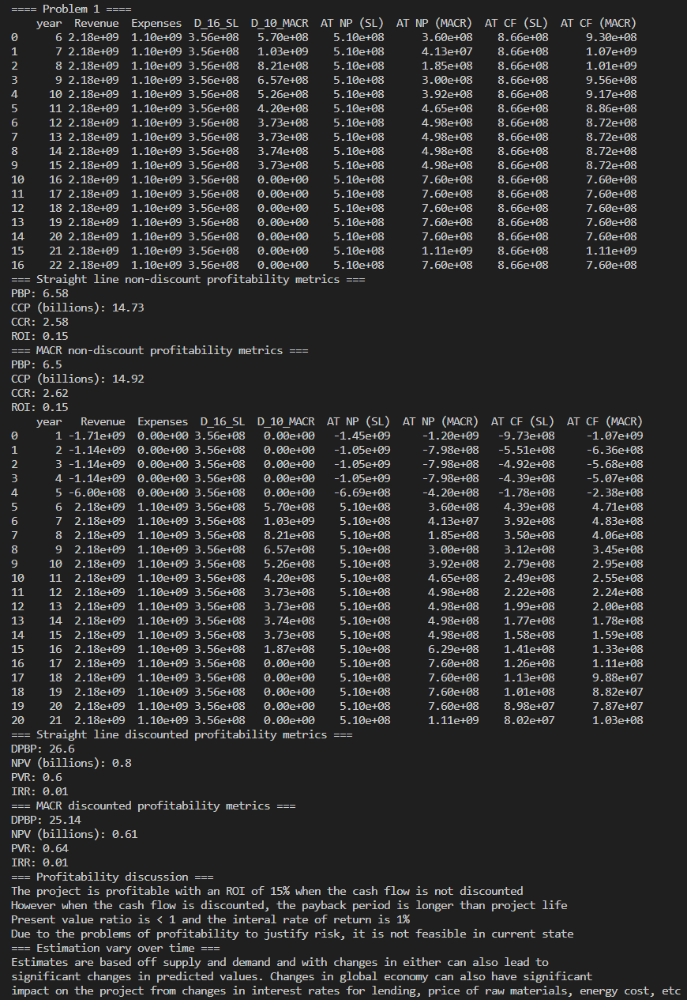
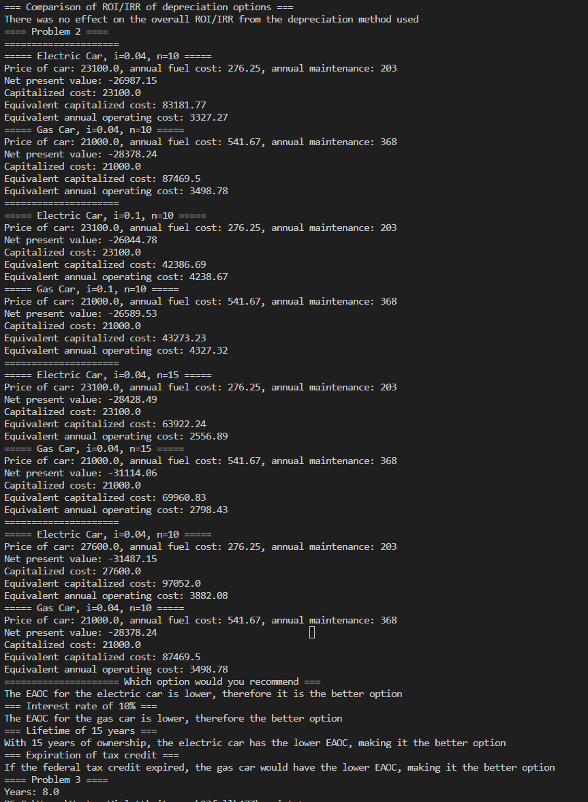

# Homeworks

# Homework 1
## [Problem Statement](https://github.com/hunterviolette/23fall/blob/main/477/hw_ps/hw1.pdf)

## [Solution](https://github.com/hunterviolette/23fall/blob/main/477/scripts/hw1.py)

# Homework 2
## [Problem Statement](https://github.com/hunterviolette/23fall/blob/main/477/hw_ps/hw2.pdf)

## [Solution](https://github.com/hunterviolette/23fall/blob/main/477/scripts/hw2.py)

# Homework 3
## [Problem Statement](https://github.com/hunterviolette/23fall/blob/main/477/hw_ps/hw3.pdf)

## [Solution](https://github.com/hunterviolette/23fall/blob/main/477/scripts/hw1.py)

