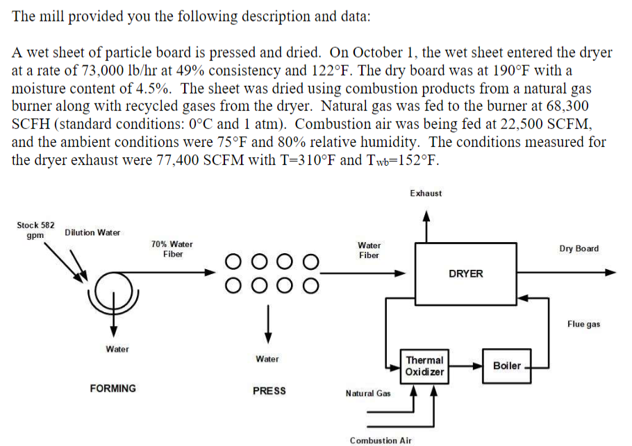
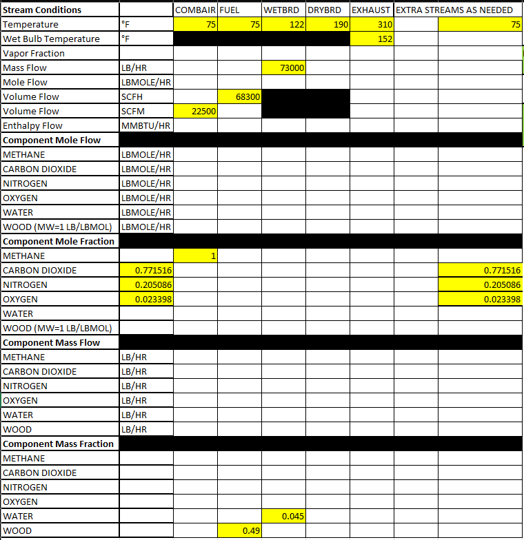
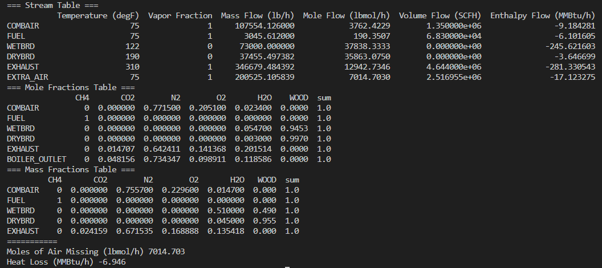

# Level One Project 
## [Problem Statement](https://github.com/hunterviolette/23fall/blob/main/478/LevelOneProj/problem_statement.pdf)

## Objective
### Solve for unknowns in table:

## [Solution](https://github.com/hunterviolette/23fall/blob/main/478/LevelOneProj/lvl1_balance.py)

