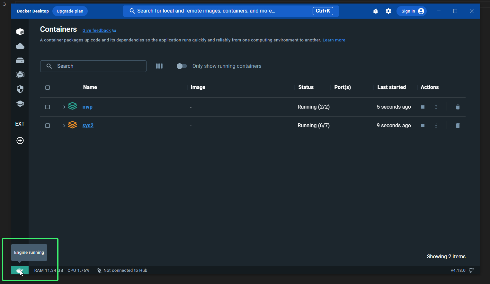
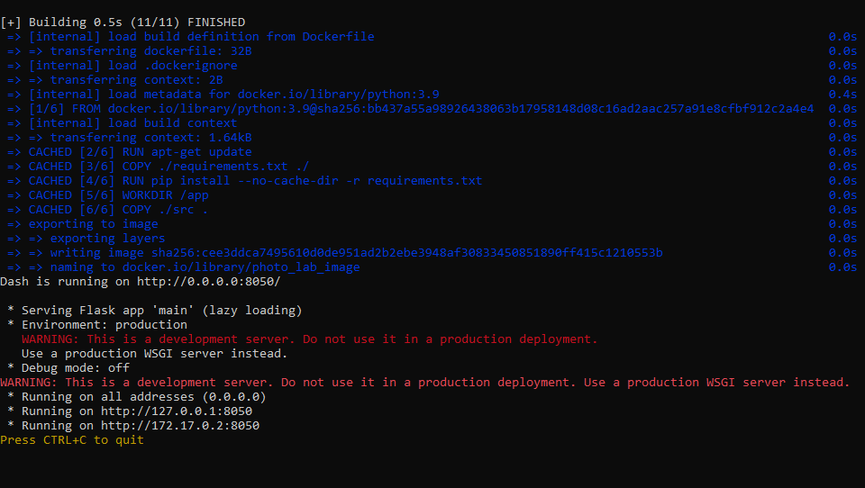
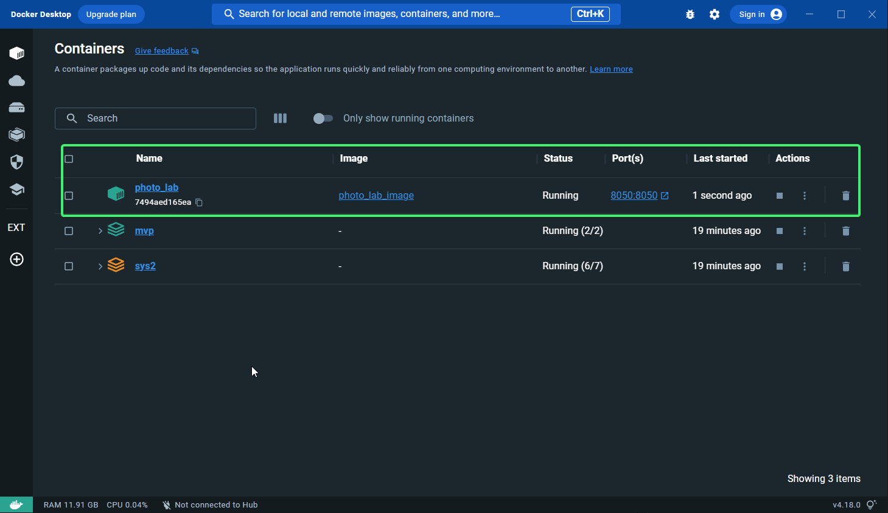
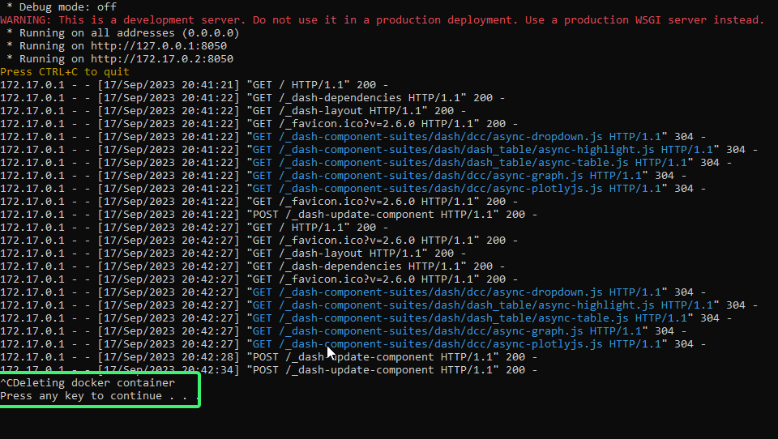

The only requirement to run the webserver is to have docker installed and running. https://docs.docker.com/engine/install/

If the docker engine is running, you will see it in the bottom left corner of docker desktop

To start the webserver, 
  For windows users: Open the run.bat file
    
    - This will build the docker image if it hasn't been built yet 
    - After the docker image is built, it will start the webserver inside the container and expose port 8050 to localhost 
    - You can access the webserver from any browser at http://localhost:8050/
    - You can see the container running from docker engine
      

    - To close the webserver, simply hit ctrl-C in the terminal
      - You may have to hit ctrl-C a few times in terminal 
      - After you close the webserver, it will automatically delete the docker container

      