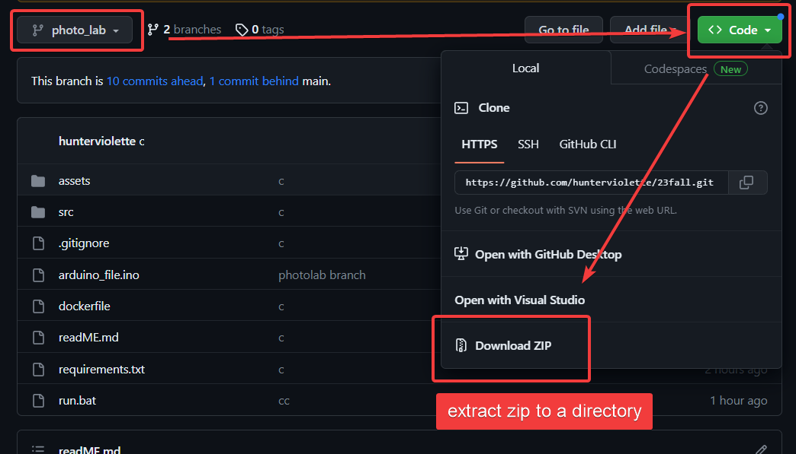

# Running the Web Server with Docker

## Prerequisites

1. Ensure that you have Docker installed and running on your system. If not, you can [install Docker](https://docs.docker.com/engine/install/).

    
    
    - The Docker Engine status should be visible in the bottom left corner of Docker Desktop.

2. Download the ZIP of this repository and extract it to a directory
    

## Starting the Web Server

### For Windows Users

1. Open the `run.bat` file.

    
    
    - This will perform the following actions:
    
        - Build the Docker image if it hasn't been built already.
        
        - Start the web server inside the Docker container.
        
        - Expose port 8050 to localhost.
        
    - You can access the web server from any browser at [http://localhost:8050/](http://localhost:8050/).
    
    
    - You can see the container running in Docker Engine.
    

2. To close the web server, simply press `Ctrl-C` in the terminal.

    - You may need to press `Ctrl-C` multiple times in the terminal.

3. After closing the web server, it will automatically delete the Docker container.
    

4. Docker uses RAM to virtualize containers and may use RAM even when no containers are running. If you are finished using docker, it may be best to restart your computer so the docker engine is no longer running. 
